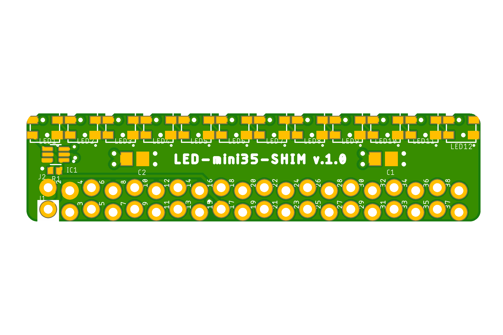

# LED-SHIM project

LED-SHIM (mini-HAT), RGB LED array for Raspberry Pi.

Sometimes it's nice to add some shine to your Pi.
This can be achieved with a line or matrix of RGB addressable LEDs.
Welcome to a new shiny world!

Some useful links:

- [pinout.xyz](https://pinout.xyz/) - a brilliant resource on topic of Pi's pinout and HATs.
- [raspberrypi/hats](https://github.com/raspberrypi/hats) - Pi's HAT specification.

## LED-mini20-SHIM

Raspberry Pi mini 40-pin **LED-mini20-SHIM** mini-HAT.

Preview:

[Schematics in PDF format](LED-mini20-SHIM.pdf)

Features:

- locked Pi headers
- data input pin selection
- 18 RGB LEDs organized in a single line
- industry standard WS2812 addressable LEDs
- small board for Pi
- can be used as SHIM (no headers) or HAT (with headers)

Pins Configuration:

|Data Pin |Option 1 |Option 2 |Option 3 |
|---------|---------|---------|---------|
|DI       |GPIO18\* |GPIO10   |GPIO21   |

\*) the pin is connected by default.

CAM files are available.
BoM and PnP files for JLCPCB are available.

## LED-mini35-SHIM

Raspberry Pi mini 40-pin **LED-mini35-SHIM** mini-HAT.

Preview:

[Schematics in PDF format](LED-mini35-SHIM.pdf)

Features:

- locked Pi headers
- data input pin selection
- 12 RGB LEDs organized in a single line
- industry standard WS2812 addressable LEDs
- small board for Pi
- can be used as SHIM (no headers) or HAT (with headers)

Pins Configuration:

|Data Pin |Option 1 |Option 2 |Option 3 |
|---------|---------|---------|---------|
|DI       |GPIO18\* |GPIO10   |GPIO21   |

\*) the pin is connected by default.

CAM files are available.
BoM and PnP files for JLCPCB are available.

## LED-zero20-SHIM

Raspberry Pi zero 40-pin **LED-zero20-SHIM** mini-HAT.

Preview:

[Schematics in PDF format](LED-zero20-SHIM.pdf)

Features:

- locked Pi headers
- data input pin selection
- 144 RGB LEDs organized in a matrix of 18x8
- industry standard WS2812 addressable LEDs
- separate DI and DO headers for extendability
- Pi zero board style
- can be used as SHIM (no headers) or HAT (with headers)

Pins Configuration:

|Data Pin |Option 1 |Option 2 |Option 3 |
|---------|---------|---------|---------|
|DI       |GPIO18\* |GPIO10   |GPIO21   |

\*) the pin is connected by default.

CAM files are available.
BoM and PnP files for JLCPCB are available.

## LED-zero35-SHIM

Raspberry Pi zero 40-pin **LED-zero35-SHIM** mini-HAT.

Preview:

[Schematics in PDF format](LED-zero35-SHIM.pdf)

Features:

- locked Pi headers
- data input pin selection
- 60 RGB LEDs organized in a matrix of 12x5
- industry standard WS2812 addressable LEDs
- separate DI and DO headers for extendability
- Pi zero board style
- can be used as SHIM (no headers) or HAT (with headers)

Pins Configuration:

|Data Pin |Option 1 |Option 2 |Option 3 |
|---------|---------|---------|---------|
|DI       |GPIO18\* |GPIO10   |GPIO21   |

\*) the pin is connected by default.

CAM files are available.

## LED-plus20-SHIM

Raspberry Pi plus 40-pin **LED-plus20-SHIM** mini-HAT.

Preview:

[Schematics in PDF format](LED-plus20-SHIM.pdf)

Features:

- locked Pi headers
- data input pin selection
- 288 RGB LEDs organized in a matrix of 18x16
- industry standard WS2812 addressable LEDs
- separate DI and DO headers for extendability
- Pi plus board style
- can be used as SHIM (no headers) or HAT (with headers)

Pins Configuration:

|Data Pin |Option 1 |Option 2 |Option 3 |
|---------|---------|---------|---------|
|DI       |GPIO18\* |GPIO10   |GPIO21   |

\*) the pin is connected by default.

CAM files are available.
BoM and PnP files for JLCPCB are available.

## How to help

Your contributions as code, resources or finances are welcome!
Please contact me directly over e-mail andriy.golovnya@gmail.com or over [GitHub profile](https://github.com/red-scorp).
Link for [Paypal donations](http://paypal.me/redscorp), which are always welcome.
Thanks in advance!
